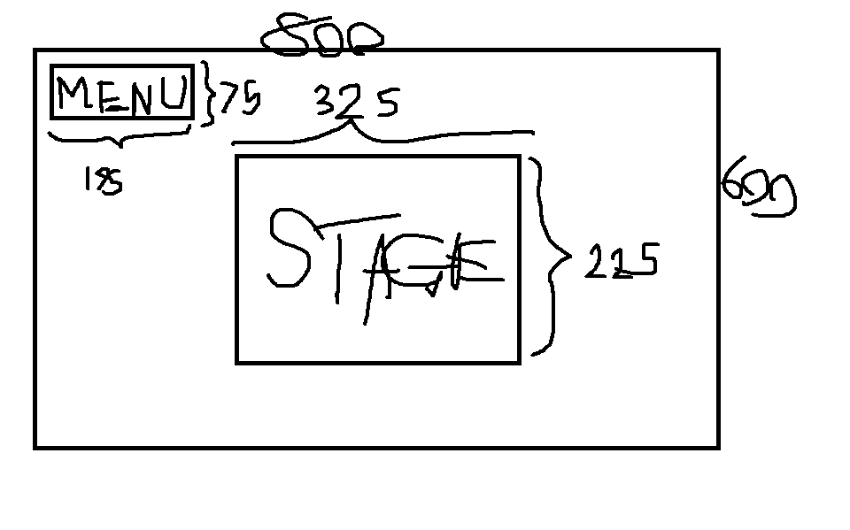

:warning: Everything between << >> needs to be replaced (remove << >> after replacing)
# CS110 Project Proposal
# << Fishing Game >>
## CS 110 Final Project
###  Fall, 2022 
### [Assignment Description](https://docs.google.com/document/d/1H4R6yLL7som1lglyXWZ04RvTp_RvRFCCBn6sqv-82ps/edit?usp=sharing)

https://replit.com/join/twhoaspfxc-willsteddin 

<< [link to demo presentation slides](#) >>

### Team: Blake and Will
#### Blake Abrenica, Will Steddin

***

## Project Description

<< Give an overview of your project >>

***    

## User Interface Design

- **Initial Concept**
  - 
  - This is the menu / title screen of the game. It includes a button to quit, the game's title, the start button, and a background image. Clicking exit ends the program, and clicking start moves into the game.
  -  
  -  This is the level select screen of the game. In theory, there would be multiple different levels, or areas, to choose from, but we weren't able to add those into our game.
  -  
  -  This is the screen of our game while running the actual game loop part. It has a moveable character that can go in any four directions. There is a trident you can throw at the fish straight forward to attempt to catch them. The character cannot step into the water. There is an exit, or retire button above the trident icon location that allows you to end the game. 
  -  
  -  This is the end screen you see after clicking the retire button. It displays text informing you of the total number of fish you caught, and what the total value of all these fish comes out to. It also puts up text informing the user how to officially end the game by exiting the program. 
 
    
- **Final GUI**
  - 
  - 
  - 
  - 

***        

## Program Design

* Non-Standard libraries
    * Pygame
      * https://www.pygame.org/docs/
      * Pygame is a library of modules designed for writing and creating video games with multimedia options including sound. 
    * Random
      * https://docs.python.org/3/library/random.html
      * Random is a library that allows for pseudo-random number generation (since true random is impossible) using the Mersenne Twister generator. 
    * From sys, exit
      * https://docs.python.org/3/library/sys.html
      * Sys is a library that allows users to interact more directly with the system. The only piece of it used in our program is exit, which signals to stop the interpreter. 

* Class Interface Design
    *
        * 
        
* Classes
    * Controller
      * The controller class runs the mainloop and all subloops of the program and is where all utilized modules are imported into the program. 
    * Background
      * The background class exists as a way to call the background image and blit it onto the screen. It also determines the y value limit the player can walk to, which would apply more with multiple different levels using different sized maps. 
    * Fish
      * The fish class handles the determination of which fish is spawned, their speeds, their rarity, their value, and checks to make sure their image is correct. It flips them when they encounter the side of the screen and contains the function to draw the fish every loop. 
    * Player
      * The player class handles movement of the player and contains the images for the different directions the player faces while walking. 
    * Trident
      * The trident class makes the throwable trident object utilized by the player possible. It contains the trident's image as well as the size and hitbox of the trident, which the controller can use to detect collision with fish. 

## Project Structure and File List

The Project is broken down into the following file structure:

* main.py
* src
    * controller.py
    * background.py
    * player.py
    * fish.py
    * trident.py
* assets
    * finalGuiScreenshots
      * finalGui_endScreen.png
      * finalGui_gameScreen.png
      * finalGui_levelSelect.png
      * finalGui_menuScreen.png
    * wireframeScreenshots
      * msPaint_endScreen.png
      * msPaint_gameScreen.png
      * msPaint_levelSelect.png
      * msPaint_menuScreen.png
    * beech.jpg
    * bloob.png
    * boy.png
    * boyback.png
    * boyside.png
    * boysideleft.png
    * classDiagram.jpg
    * clownfish.png
    * guppy.png
    * shark.png
    * waaavey.jpg
    * yellow.png
    * EndlessBossBattleRegular-v7Ey.ttf
      
        
* etc
    * N/A

***

## Tasks and Responsibilities 

   * Will did a large portion of the programming while Blake focused on coming up with ideas and finding the visuals and how to make them work together. Blake did help with the programming as well, and we worked together for many hours side by side to figure things out and understand how to fix any errors. 

## Testing

* The testing was very much done bit by bit as we slowly built the program up. The pieces of the program were built very linearly, in that we would add a new feature and then run through the whole program to see how it interacted with what we already had, so that if there were any mistakes or errors, we would know which area of the code they came from and be able to react and solve them accordingly.  

## ATP

| Step                 |Procedure             |Expected Results                   |
|----------------------|:--------------------:|:---------------------------------:|
|  1                   | Type "python3 main.py" into the Shell and hit enter. |GUI Menu Screen window appears with Title, Start, and Quit buttons  |
|  2                   | Click Start button  | Display fills with white except for start button, which flashes green. Then, GUI Level Select screen appears with Level Button and <-Menu Button.      |
| 3 | Click Blue Level Button | Display wipes, and is replaced by GUI Game Screen window with character, fish moving back and forth, and Retire button. |
| 4 | Press and hold left arrow key | Character image turns left and moves left until briefly after arrow key is released. |
| 5 | Press and hold right arrow key | Character image turns right and moves right until briefly after arrow key is released. |
| 6 | Press and hold up arrow key | Character image turns up and moves up until briefly after arrow key is released. |
| 7 | Press and hold down arrow key | Character image turns down and moves down until briefly after arrow key is released. | 
| 8 | Press space bar | Trident appears at player location and moves upward until off screen, when it stops and reappears in the bottom corner. If trident collides with a fish, that fish disappears and a corresponding point value to the type of fish is added to the counter at the bottom of the screen. |
| 9 | Click Retire Button | Display wipes to black, GUI end screen window appears. After a brief pause, lines of text appear on screen staggered that reveal the total number of fish and total value of fish caught. Another line of text appears, informing players how to end the program. |
| 10 | Press Q | The pygame module and replit interpreter quit and all windows close. |
